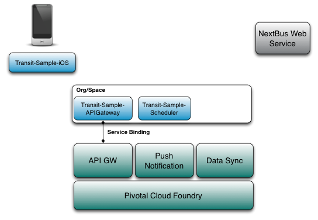

= Pivotal CF Mobile Services Field Demo

This document outlines the steps required to demo Pivotal Cloud Foundry Mobile Services using the Transit Application.

=== Agenda
* Introduce Mobile Services on Cloud Foundry
* What we are going to see? Case for Microservices based architecture for Agile Mobile Application Delivery
* Transit App - Big Picture
* Demo
* What we saw ? Microservices based architecture for Agile Mobile App Delivery using Cloud Foundry
* Q/A

=== Introduce Mobile Services on Cloud Foundry

image:./images/PCF_MobileService.png[Mobile Services on Cloud Foundry]

* Data Sync

Mobile Optimized API's for cloud based data storage service which can sync data across devices and uses federated (Oauth) identity.

* API Gateway

Deliver mobile-optimized, device specific content from backend microservices on a cloud scale and manage the interface lifecycle through versioning.

* Push Notification

Push Notification service at cloud scale and across platforms with granular control over the data, tags and devices.

* App Distribution

Enable testers to easily download developer versions of apps over-the-air (OTA) to mobile devices and

{ Question is this just for Testers like Hockey App or a full MDM?}

For more detailed Technical Deck, refer to the pitch deck from Product Manager: link:https://drive.google.com/open?id=0B0FpBXIzbQ9pemtFQkowUzhmaG8&authuser=0[Mobile Pitch Deck]

=== What we are going to see?
==== Case for Microservices based architecture for Agile Mobile Application Delivery

Mobile app development is agile and fast changing as new market demands and customer requirements come in. Organization building great mobile apps, have a agile team  interfacing with the backend application teams which are slow to react. Hence building and exposing backend services as microservices at a cloud scale and consuming them

Pivotal has build great applications of many organizations over XXX years and build reusable platform microservices which are used by everyone in the industry. These microservices are available at a cloud scale on Pivotal Cloud Foundry.

=== Transit App - Big Picture

==== The Transit Mobile App
The Transit App is a sample mobile application which shows the public transportation routes for the city of Toronto.
This app combines the Pivotal Cloud Foundry platform with the Pivotal Mobile Services, namely Data Sync, Push Notification
and Api Gateway to give a mobile user the ability to create bus routes of interest and receive push notifications based on
predictions.

==== Components of Transit App: Client and Platform Apps and Microservices

The transit application consist of the following components:

==== Transit Application
The transit mobile application provides a simple way to register for bus routes of interest and receive notifications when
a route is predicted to route late. The application authenicates users after launch using the data synch authenication service
and retrieves existing user-saved bus routes from the data synch mobile service. There is native applicaiton for iOS and Android
devices.

==== Transit Sample API Gateway
The transit sample API gateway application makes external web service calls to the NextBus web service and performs XML->JSON
translation. This application is deployed into Pivotal Cloud Foundry into an organization and space is and bound to the API Gateway
service. The demo environment already has this application deployed.

==== Transit Sample Scheduler
The transit sample scheduler application is a ruby based application that reviews the stop predictions and sends push notifications
to mobile users that registered with those bus routes. The demo environment already has this application deployed.

==== NextBus Web Service
link:http://www.nextbus.com/predictor/stopSelector.jsp?a=ttc[NextBus] is a third party web service which delivers a list of bus
routes, service alerts and predictions. It is used by the API Gateway to retrieve service information about mobile user routes.

=== Demo

==== Demo Environment
The demo environment has the following Pivotal products installed and ready for you to demo. This environment is typically the latest
GA products and is pre-confogured with the external vender services like Apple Push Notification Service (APNS)

* Pivotal Operations Manager
* Pivotal Cloud Foundry (Elastic Runtime)
* Pivotal Data Synch
* Pivotal API Gateway
* Pivotal Push Notification

==== Steps:

* Launch the Transit App on the device
{ Device Screen Shot} and use [link:qt.adoc] QuickTime Movie  or [link:reflector.adoc] Reflector

* Authentication
{ Screen Shot}
Use Google Authentication to authenticate
Data sync service uses the Oauth token to create a datastorge on the cloud for the customer.

* Fetch Routes
{ Screen Shot}
API Gateway converts the Next Web Service XML to mobile optimized device specific Routes information.

* Add Notification (to and From)
Register for Push Notification and add a route to be notified. The scheduler app checks the likelihood of a bus arriving at a destination based on the Next Web Service and notifies the devices registered for notification.

Google Notification Workflow
{ Screen Shot}

Apple Push Notification Workflow
{ Screen Shot}

=== Behind the scenes - Microservices on the cloud platform

Pivotal Cloud Foundry Push Notification Dashboards and Services
{ Screen shots}

Data Sync Dashboard and Services

{ Screen Shots}

Ops Manager Tiles for Push Notification, Data Sync and API Gateway

{ Screen Shots}

=== What we saw today ...
==== Microservices based architecture for Agile Mobile App Delivery using Cloud Foundry

=== Q/A
