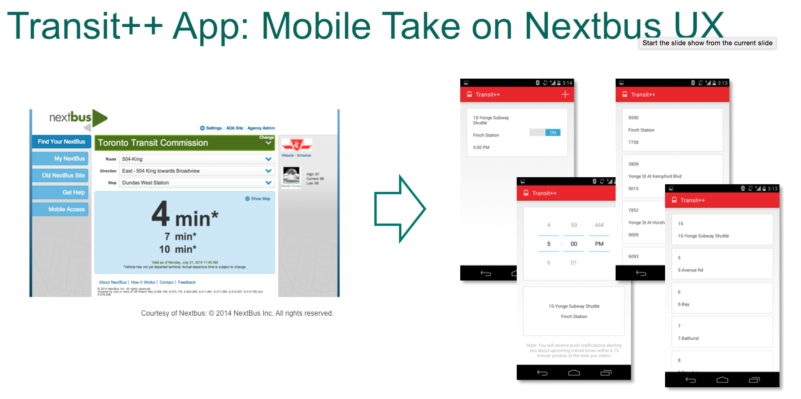
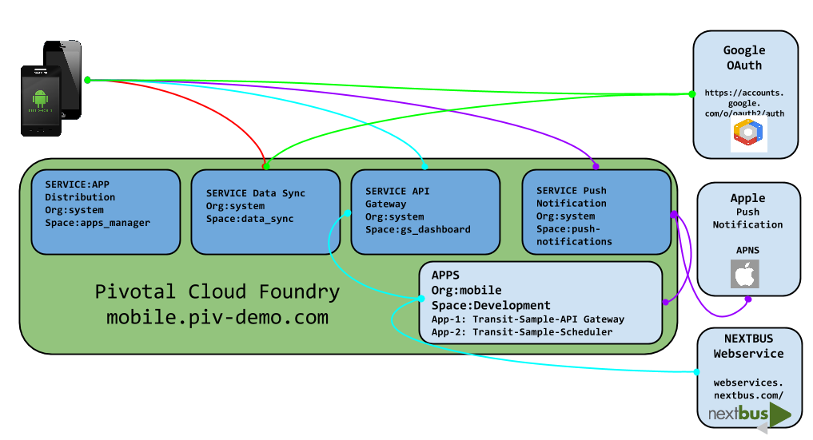
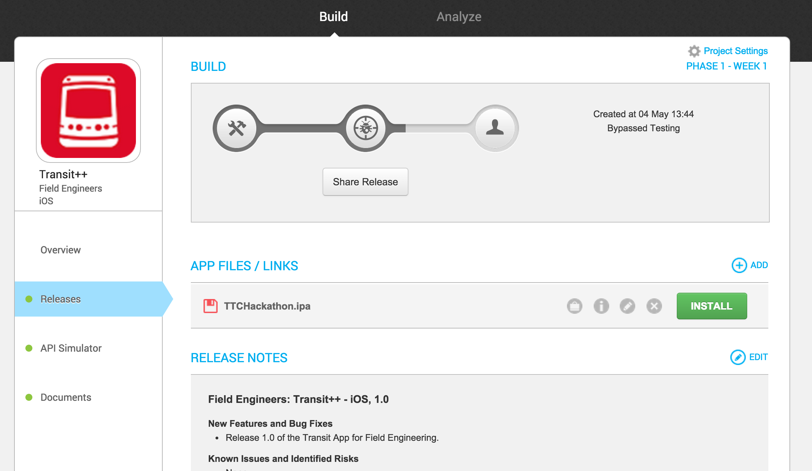
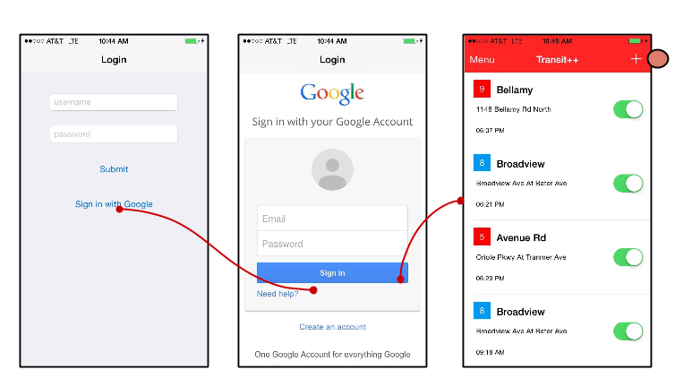
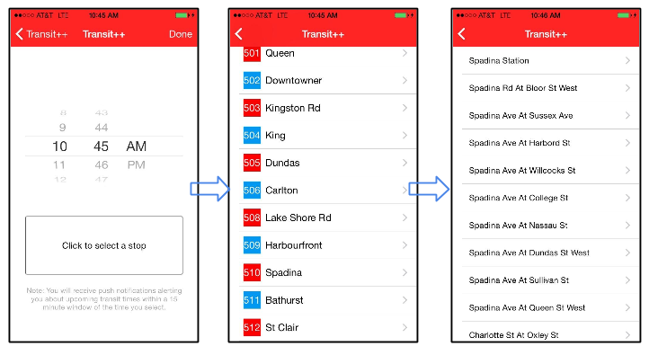
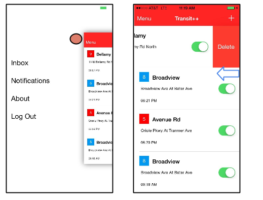

= Pivotal CF Mobile Services Field Demo

This document provides a brief description of the Pivotal Mobile Services for Cloud Foundry and outlines the steps required to demonstrate the Transit++ mobile application using Pivotal Cloud Foundry Mobile Services.

== Description of the Mobile Services on Cloud Foundry

image:./images/PCF_MobileService.png[Mobile Services on Cloud Foundry]

*Data Sync*

Mobile Optimized API's for cloud based data storage service which can sync data across devices and uses federated (Oauth) identity.

*API Gateway*

Deliver mobile-optimized, device specific content from backend services on a cloud scale.Transform and aggregate legacy backend APIs into mobile-friendly endpoints that are optimized for latency- sensitive, limited battery-life devices of varying sizes.

*Push Notification*

Push Notification service at cloud scale which is not affected by noisy neighbours, works with Apple, Google, Microsoft push services and gives granular control over the data.

*App Distribution*

Enable testers to easily download developer versions of apps over-the-air (OTA) to mobile devices, secured via login and role-based access control and early feedback to the developers to support iterative development. 

For more detailed Technical Deck, refer to the pitch deck from Product Manager: link:https://drive.google.com/open?id=0B0FpBXIzbQ9pemtFQkowUzhmaG8&authuser=0[Mobile Pitch Deck]

== Pivotal Cloud Foundry is "The Platform for Mobility."

Customers most likely would have a mBaaS solution. How does PCF fit into the picture and where is the market trending? Refer to this document link:content.adoc[Platform for Mobility] +

== Transit++ mobile application on Pivotal Cloud Foundry
The Transit++ App is a sample mobile application which shows the public transportation routes for the city of Toronto.
This app combines the Pivotal Cloud Foundry platform with the Pivotal Mobile Services, namely Data Sync, Push Notification
and Api Gateway to give a mobile user the ability to create bus routes of interest and receive push notifications based on
predictions.

==== Components of Transit++ App: Client and Platform Apps and Microservices

The transit++ application consist of the following components:

==== Transit++ Application
The transit++ mobile application provides a simple way to register for bus routes of interest and receive notifications when
a route is predicted to route late. The application authenicates users after launch using the data synch authenication service and retrieves existing user-saved bus routes from the data synch mobile service. There is native applicaiton for iOS and Android devices.

==== Transit++ Sample API Gateway
The transit++ sample API gateway application makes external web service calls to the NextBus web service and performs XML->JSON
translation. This application is deployed into Pivotal Cloud Foundry into an organization and space is and bound to the API Gateway service. The demo environment already has this application deployed.

==== Transit++ Sample Scheduler
The transit++ sample scheduler application is a ruby based application that reviews the stop predictions and sends push notifications to mobile users that registered with those bus routes. The demo environment already has this application deployed.

==== NextBus Web Service
link:http://www.nextbus.com/predictor/stopSelector.jsp?a=ttc[NextBus] is a third party web service which delivers a list of bus routes, service alerts and predictions. It is used by the API Gateway to retrieve service information about mobile user routes.

== Demo

=== Demo Environment
The demo environment has the following Pivotal products installed and ready for you to demo. This environment is typically the latest GA products and is pre-confogured with the external vender services like Apple Push Notification Service (APNS) and Google OAuth. 

User/Password: pdemo/mobile@123 +
Org/Space: tranist-demo/development

* link:https://opsmgr.mobile.piv-demo.com[Pivotal Operations Manager]
* link:https://apps.corpdemo.fe.pivotal.io[Pivotal Cloud Foundry (Elastic Runtime)]
* link:http://datasync-dashboard.corpdemo.fe.pivotal.io/metrics[Pivotal Data Synch]
* link:http://gs-dashboard.corpdemo.fe.pivotal.io[Pivotal API Gateway]
* link:http://push-notifications-dashboard.corpdemo.fe.pivotal.io[Pivotal Push Notification]

=== Steps:
. Download the Tranist++ application from XLStudio
. Authenitcate using Google OAuth
. Register for push notifications
. Receive push notification.
. Remove push notifications or delete routes (optional).

==== Step 1 Download the Tranist++ Application form XLStudio 
Download the link:https://xlstudio.com/#/projects/491/build/releases/9903[Transit++ App for Field Engineers on iOS] from the XLStudio App Distribution. Use link:http://www.tekrevue.com/tip/record-iphone-screen-quicktime[QuickTime Movie] to demo the App from your Laptop for remote sessions or presentations. 

[NOTE]
You will need an account to download the app from XLStudio. Ask your FE manager for access to XLStudio. 

[WARNING]
The Transit++ iOS App is signed using Pivotal's Apple Enterprise Profile certificates; so it can be distributed to all Pivotal employees. 
We MUST not allow the binary to be installed on any device that does not belong to a Pivotal Employee. Failing to do so may prompt Apple to revoke our certificates which has a drastic impact on every internally built iOS application today.

==== Step 2 Launch the App and Authenticate using Google OAuth. 

Data sync service uses the Oauth token to create a datastorage on the cloud for the customer.The Application home page shows the list of Routes you are interested in getting notified on. 

[NOTE] 
You can use Google account to authenticate including your Pivotal Account. +

==== Step 3 Register for Push Notifications (to and From)

Register for Push Notification and add a route to be notified. The scheduler app checks the likelihood of a bus arriving at a destination based on the Next Web Service and notifies the devices registered for notification.

[Note]
*501 Younge and Bay Street* have frequent stops which can be used for notifications. 

[Note]
Push messages are only available to be sent to actual devices and not Simulators. +

==== Step 4 Delete or Unsubscribe Notification and Logout

To delete a Route, swipe the Route left, and you will see the delete button. To unsubscribe, slide the radio button to off. 

=== Additional Details Every FE Should Know

For behind the scenes configuration refer to the link:transit-pcf.adoc[How Does it Work] +

== Q/A
[qanda]
How does this work?:: Sample Answer
Question 2:: Answer 2
