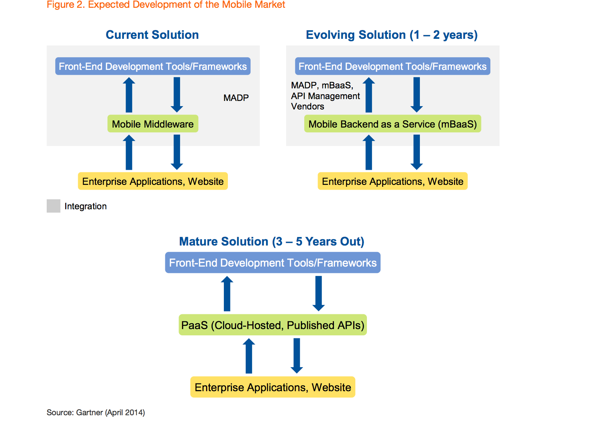

== Three reasons why Pivotal Cloud Foundry is the Platform for Mobility:

=== 1. Microservices based architecture 

Mobile apps have resulted in highly exponential and dynamic workloads with zero downtime. They require a modern cloud platform which is highly scalable, highly secure and enterprises have full control of data. Legacy backend systems can provide the enterprise data using Microservices on a enterprise cloud platform to serve the new Mobile first apps.

These apps developed on the "Platform for Mobility" have the ability to:

* Scale up for dynamic workloads from Mobile Apps
* Organized around a business functionality, do one thing, well
* Independently developed, deployed and scaled without interdependency 
* Designed for failure

For more info on how to delivery mobile apps faster using microservices watch the video at: link:https://www.youtube.com/watch?v=xIXIFx22F98#t=328[The Mobile First World Deliver Mobile Apps Faster]

=== 2. Current mBaas Solutions to an Enterprise PAAS 

Gartner predicts that Emerging cloud mobile back-end services threaten to replace mobile middleware for
enterprise mobile app developers. As mBaaS services mature, the entry of general-purpose middleware and PaaS
vendors into the mobile market will expand the options for mobile development leaders and architects, resulting in best-in-class specialized cloud mobile services as opposed to bundles of services.

For more details refer to the Gartner Research note here link:https://sites.google.com/a/pivotal.io/analyst-relations/agile-apps/gartner-thetransformationofmobilemiddleware-internal/The%20Transformation%20of%20Mobile%20Middleware.pdf?attredirects=0[Gartner Note]

=== 3. Continous Delivery and Innovation 
Mobile app development brings new requirements and with it new challenges. Mobile Apps provide a new engagement model as they have to support new devices, new sensors and new user behaviour. Mobile Apps typically have 10-24 releases per year.

Pivotal Labs has built 100's of Mobile Apps using these design principles of Microservices and delivered them on Pivotal Cloud Foundry. Dwayne Forde from the Cloud Foundry Mobile Services team at Pivotal discusses in this blog post link:http://blog.pivotal.io/cloud-foundry-pivotal/case-studies-2/how-pivotal-performs-continuous-delivery-of-mobile-services[How Pivotal Performs Continuous Delivery of Mobile Services] on Pivotal Cloud Foundry:

[quote]
"Continuous Integration (CI) and Continuous Delivery (CD) play a large role in Pivotal’s agile engineering culture. 
Integration testing can be simulated in many different ways, but when it comes to Mobile Services, the only viable solution 
is to use real devices. We have implemented a method that offers an automated 360 view of our product quality throughout the 
development process, from the installation of a tile in Pivotal Cloud Foundry Ops Manager to delivery of end-user mobile 
applications that use products such as the Push Notification Service."

== What we saw today ...
=== Microservices based architecture for Agile Mobile App Delivery using Cloud Foundry
Mobile apps require a modern cloud architecture and platform to delivery at the agility and scale demanded by the customers. 
Microservices based architecture are best fit for mobile app delivery, but to build microservices on your own is a huge task. 
The microservice architecture can introduce operational complexity, asynchronous communication across services is difficult, careful coordination is required between the various development teams and there are testing challenges as the pace of innovation and release cycles is very short. It takes a platform to build enterprise mobile apps.

Well known sites such as Netflix, eBay, Amazon.com, Groupon, and Gilt have all evolved from a monolithic architecture to a microservice architecture.
link:http://www.infoq.com/articles/microservices-intro[Ref: Introduction to Microservices]

Pivotal Mobile Services on Pivotal Cloud Foundry can significantly accelerate your development and mobile application delivery on a cloud platform. 

