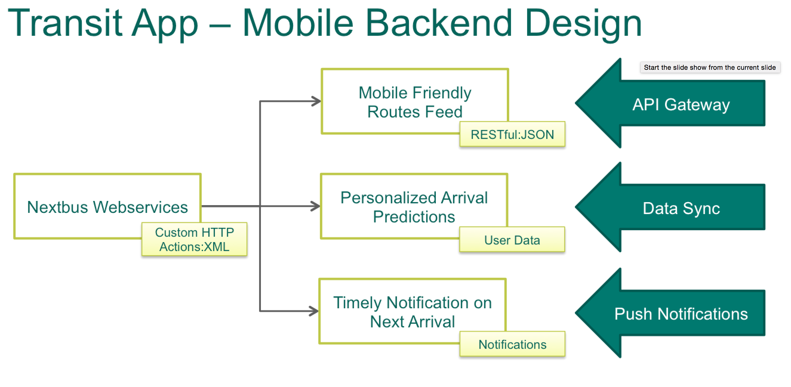
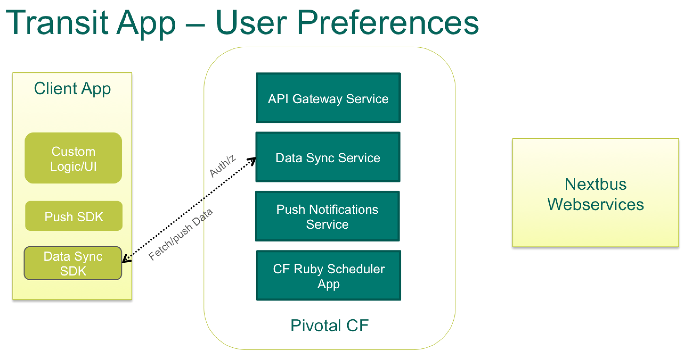
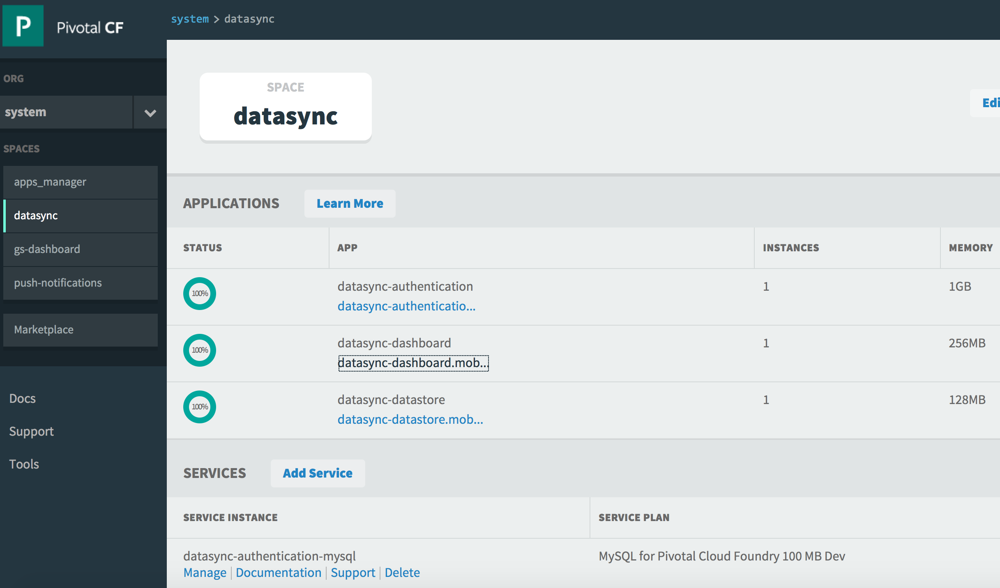
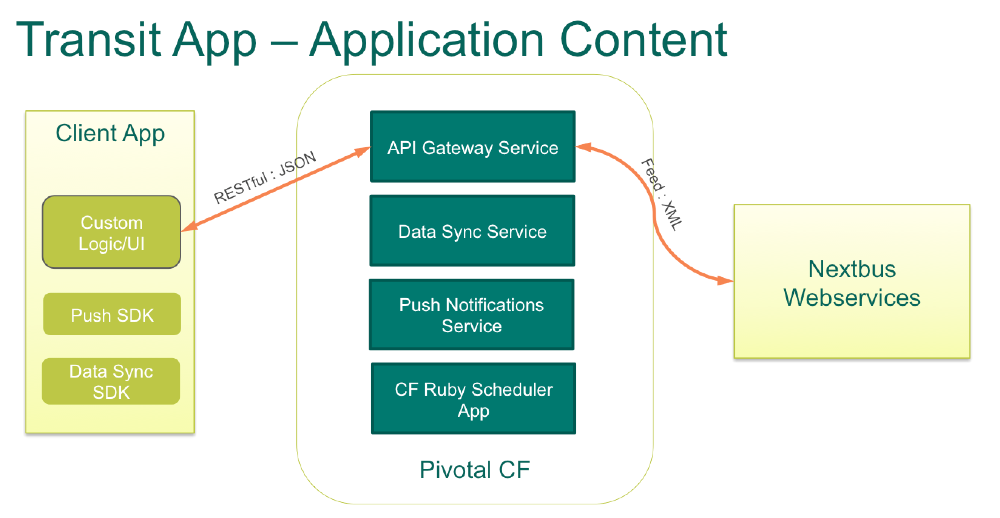
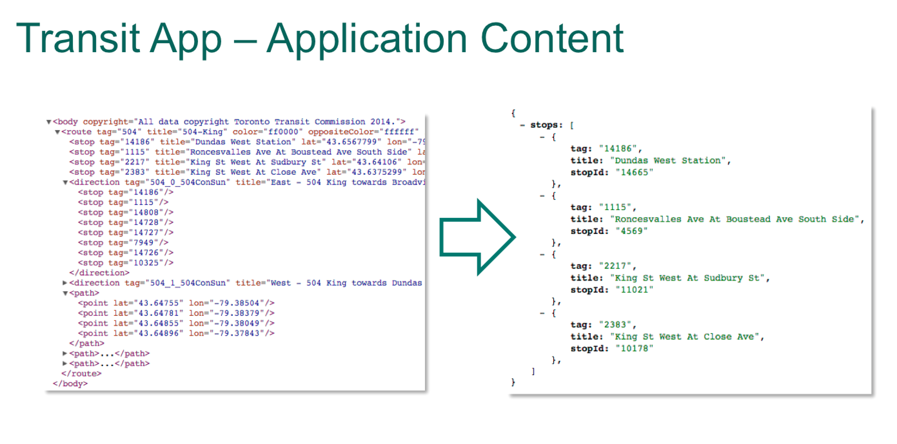
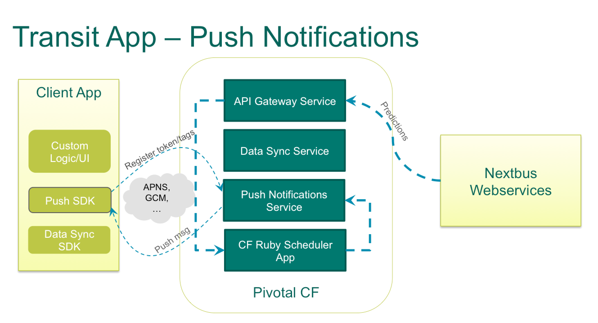
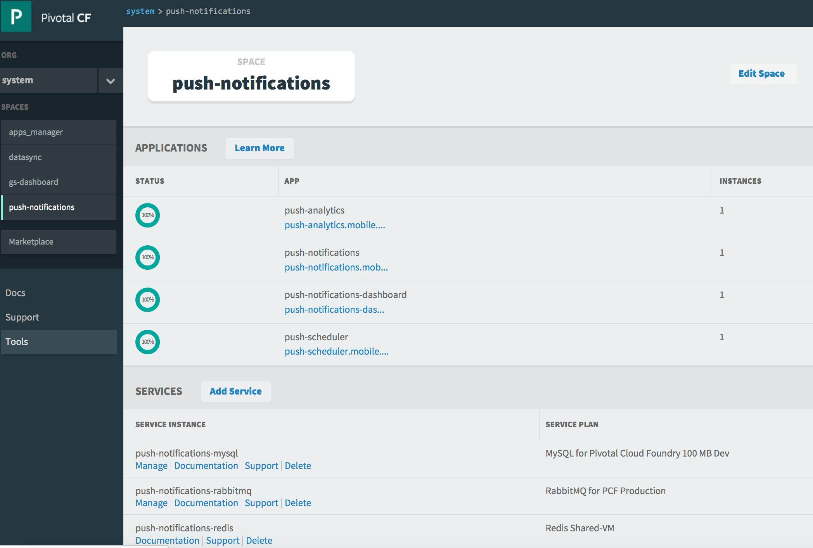
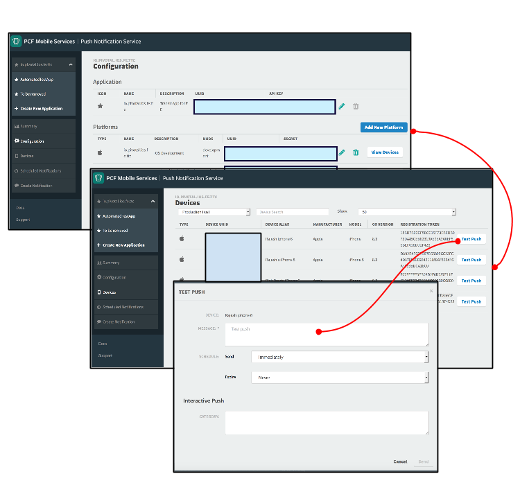
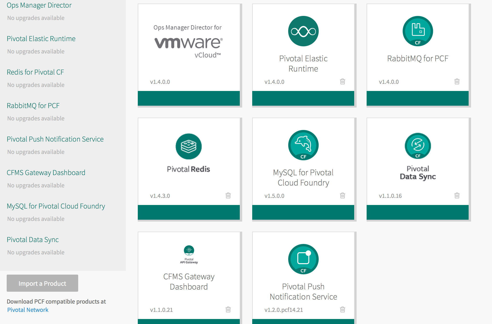

= Work in Progress. This document will be updated with details on how this demo works and suggested steps to learn further =

=== Behind the scenes - Microservices on the cloud platform
The Transit mobile backend uses various Pivotal mobile services on the Pivotal Cloud Foundry Platform. 

==== Datasync
The Mobile App uses the Pivotal Data-sync mobile services to save user preferences, routes across devices. 

*Datasync Workflow*

Launch the Datasync Service Dashboard from here link:http://datasync-dashboard.mobile.piv-demo.com/metrics[Pivotal Data Synch]

==== API Gateway

==== Push Notification
Pivotal Cloud Foundry Push Notification Dashboards and Services

*Push Notification Workflow*

Launch the Push Notification Service Dashboard from here link:http://push-notifications-dashboard.mobile.piv-demo.com[Pivotal Push Notification]

Create a Test Push Message to immediately deliver the message on your phone. 

==== Ops Manager
Pivotal Cloud Foundry Ops Manager Configuration for Mobile Services

Launch the Ops Manager from here link:https://opsmgr.mobile.piv-demo.com[Pivotal Operations Manager]

